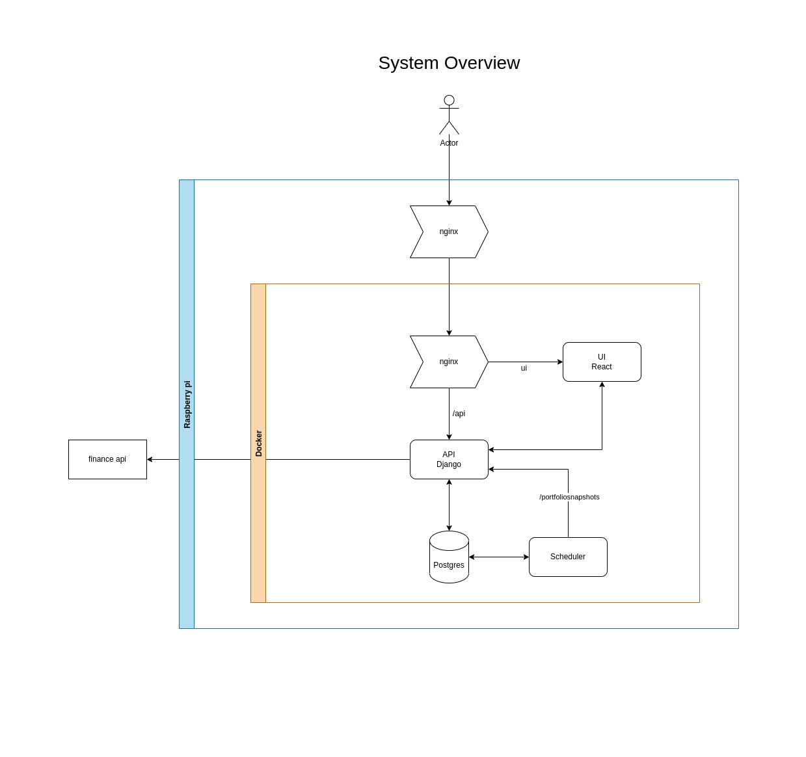

# Portfolio App

## Architecture


## JWT Flow


## Services
- [Api](https://github.com/berkayersengun/portfolio-api) (Django Rest Framework)
- [UI](https://github.com/berkayersengun/portfolio-ui) (React)
- Postgres
- Nginx

## Deployment
**URL:** https://berkay.jumpingcrab.com

### Demo account:
**username:** demo

**pass:** demo

# Crontabs
## Sudo
- Renew certificates with certbot (Letsencrpyt) at midnight everday
    ```shell
    0 0 * * * date +\%d-\%m-\%Y::\%H:\%M:\%S >> $HOME/cronlogs/certbot.log && /usr/bin/certbot renew --webroot -w /var/www/html/ >> $HOME/cronlogs/certbot.log 2>&1
    ```
## User
- Update Dynamic with FreeDns at midnight everday
  ```shell
  0 0 * * * date +\%d-\%m-\%Y::\%H:\%M:\%S >> $HOME/cronlogs/freedns.log && curl https://freedns.afraid.org/dynamic/update.php?TlRseUtSeWtPaGJhT2VvZlJXNldwbFNQOjE5OTY1MDc3 >> $HOME/cronlogs/freedns.log 2>&1
  ```